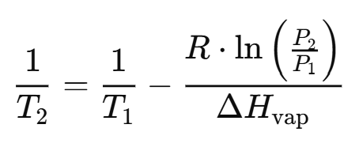

# Frostfire Rocket Engine Sizing

## Overview
This module includes all preliminary calculations and analysis made for Frostfire. Some calculations that are one-offs or quite short are not included here and can likely be found in the Frostfire.xlsx. 

## Equations Appendix

**Throat Pressure Calculation**

**Coolant Boiloff**

**Thermal Expansion**

![[FIG 4] Thermal Expansion](images/thermal_expansion.png)